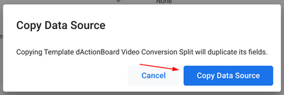
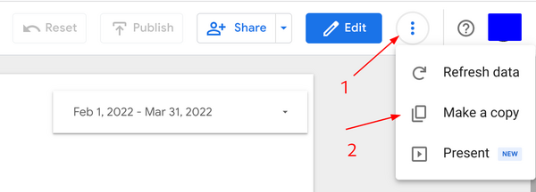
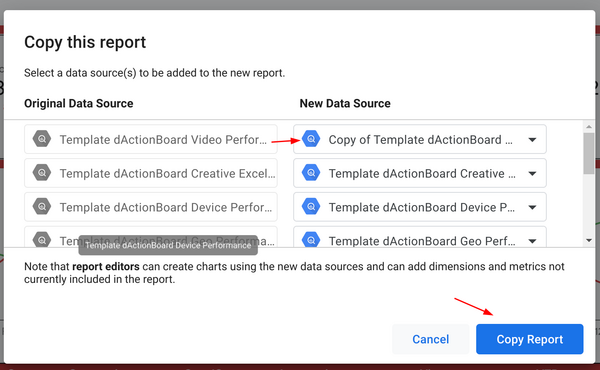

# Creating dActionBoard in DataStudio

Once data for dActionBoard data are generated and stored in BigQuery you can
proceed with replication which consists of two steps:

* Replication of datasources
* Replication of dashboard

## Replicate datasources

Before replicating the dashboard you need to make copies of datasources that power up the dashboard.
Replication of the datasources is important since they contains multiple calculated metrics which could be problematic to create from scratch.

Make a copy of each of the following 8 datasources used in the template dashboard.
* [Video Performance](https://datastudio.google.com/c/u/0/datasources/c15b4e79-af56-4eba-b1e7-562ec1c4b9f4)
* [Ad Video Performance](https://datastudio.google.com/c/u/0/datasources/ec8dcbbf-cb84-461b-a866-47beb286131a)
* [Geo Performance](https://datastudio.google.com/c/u/0/datasources/eae3304d-bf7a-4a12-9bf7-87d81d5877f6)
* [Device Performance](https://datastudio.google.com/c/u/0/datasources/7d8a8244-7aad-46cd-8e30-815337a32c32)
* [Gender Performance](https://datastudio.google.com/c/u/0/datasources/891232ad-0a3e-4c34-ad02-3c2d58f175f7)
* [Age Performance](https://datastudio.google.com/c/u/0/datasources/9391d85e-7b1a-4b3a-8324-42715f02a0e7)
* [Video Conversion Split](https://datastudio.google.com/c/u/0/datasources/9391d85e-7b1a-4b3a-8324-42715f02a0e7)
* [Creative Excellence](https://datastudio.google.com/c/u/0/datasources/5cf90865-eda5-4db3-9deb-31d6ccee7b07)

In order to replicate a datasource, please do the following:
* Click on the datasource link above.
* Click on *Make a copy of this datasource*

	

* Confirm copying by clicking *Copy Data Source*

	

* Select *MY PROJECTS* and either pick a project or enter project id manually (this should be the project where dActionBoard tables are located)
* In Dataset select a BQ dataset where dActionBoard tables are located

	
* Select a table from the dataset which the name similar to Data Source name (i.e., if Data Source is called Video Conversion Split look for the table which is called video_conversion_split)

	

* Confirm copying by clicking *RECONNECT* button.

	

> Don’t forget to rename the datasource so you can find it easily. I.e. such name as *Copy of Template dActionBoard Video Performance* is a bit mouthful, you can name it simply *dActionBoard Video Performance* or *YOUR-COMPANY-NAME dActionBoard Video Performance*.

* Repeat the steps above for all the datasources.

Now that you’ve copied each of the datasources, make a copy of the dashboard and replace each of the template’s datasources with the corresponding datasource you copied.

## Replication of the dashboard

> Please ensure that ALL datasources are created before proceeding to replication of the dashboard.

You can access the template version of the dashboard [here](https://datastudio.google.com/c/u/0/reporting/ad41d2ca-1d20-43a2-97b8-6cfa141e0f7a/page/T20t/).

In order to replicate dashboard please do the following:

* make a [copy of the dashboard](https://support.google.com/datastudio/answer/7175478?hl=en#zippy=%2Cin-this-article) by clicking on *More options - Make a copy*.

	

* In *Copy this report* window map original datasources to the ones you created in the previous step.

	

Once all template datasources are replaced with new ones, click *Copy Report* and enjoy your new shiny dActionBoard!

